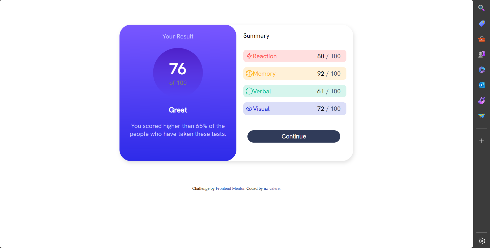

# Frontend Mentor - Results summary component solution

This is a solution to the [Results summary component challenge on Frontend Mentor](https://www.frontendmentor.io/challenges/results-summary-component-CE_K6s0maV). Frontend Mentor challenges help you improve your coding skills by building realistic projects. 

## Table of contents

- [Overview](#overview)
  - [The challenge](#the-challenge)
  - [Screenshot](#screenshot)
  - [Links](#links)
  - [Built with](#built-with)
  - [What I learned](#what-i-learned)
  - [Useful resources](#useful-resources)
- [Author](#author)
- [Acknowledgments](#acknowledgments)

**Note: Delete this note and update the table of contents based on what sections you keep.**

## Overview

### The challenge

Users should be able to:

- View the optimal layout for the interface depending on their device's screen size
- See hover and focus states for all interactive elements on the page
- **Bonus**: Use the local JSON data to dynamically populate the content

### Screenshot



Add a screenshot of your solution. The easiest way to do this is to use Firefox to view your project, right-click the page and select "Take a Screenshot". You can choose either a full-height screenshot or a cropped one based on how long the page is. If it's very long, it might be best to crop it.

### Links

- Solution URL: [Add solution URL here](https://your-solution-url.com)
- Live Site URL: [Add live site URL here](https://nz-valere.github.io/SummaryViewer/)

### Built with

- Semantic HTML5 markup
- CSS custom properties
- Flexbox
- CSS Grid
- Mobile-first workflow

### What I learned

Use this section to recap over some of your major learnings while working through this project. Writing these out and providing code samples of areas you want to highlight is a great way to reinforce your own knowledge.

To see how you can add code snippets, see below:

```css
@media(max-width: 650px){
    .big{
        display: flex;
        flex-direction: column;
        margin-top: 0px;
        width: 100%;
        /* background-color: black; */
        height: 98%;
    }
    .left{
        margin-inline: 0px 0px;
        width: 100%;
        border-radius: 0px 0px 30px 30px;
    }
    body{
        width: 100%;
    } 
    .right{
        display: flex;
        flex-direction: column;
        align-self: center;
        width: 90%;
    }
    
}

```

### Useful resources

- [Example resource 1](https://www.openai.com) - This helped me for XYZ reason. I really liked this pattern and will use it going forward.

## Author

- Website - [Add your name here](https://www.your-site.com)
- Frontend Mentor - [@nz-valere](https://www.frontendmentor.io/profile/nz-valere)

## Acknowledgments

I wanted to take a moment to express my gratitude to a friend for an invaluable support and assistance throughout my development project. Your dedication and willingness to lend a helping hand have been instrumental in making this endeavor a success.

Your expertise have not only enriched the project but have also greatly contributed to my growth as a developer. I truly appreciate the time and effort you've invested, and I am immensely grateful to have you as a friend and collaborator.

Thank you once again for your unwavering support and belief in our vision. I look forward to many more fruitful collaborations in the future."